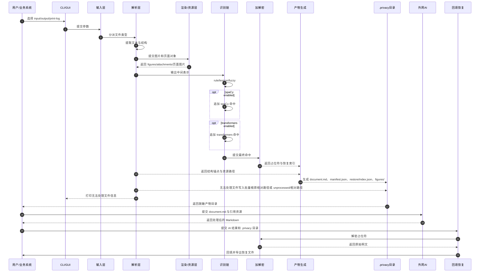
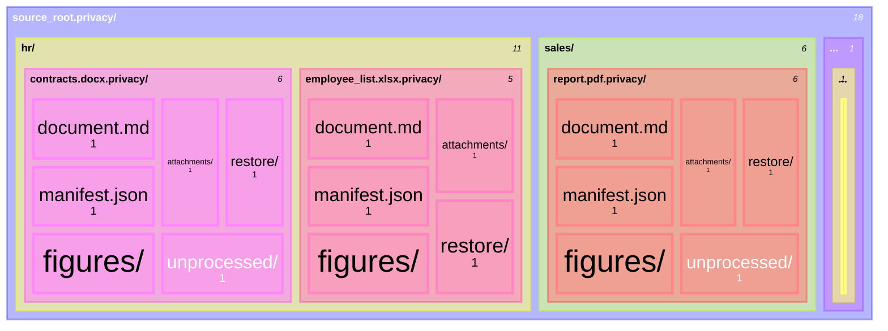

# PrivCage

内网本地隐私脱敏工具。它把 Office/PDF/文本等文件解析成带占位符的 Markdown 工作目录，交给外网 AI 处理后，再在内网用本地配置密钥回填恢复。

核心边界：

- 密钥只在内网保存。
- 外网只接触脱敏后的 `document.md` 与引用资源。
- 每个文件生成独立 `.privacy/` 产物目录。
- 批量目录处理时保持原目录结构。

## 1. 交互方式

提供两种入口：

- `CLI`
- `GUI(exe)`，直接调用同一套 CLI 处理逻辑

CLI 参数：

| 参数 | 说明 |
| ---- | ---- |
| `--input` | 输入文件或文件夹 |
| `--output` | 输出根目录 |
| `--print-log` | 将普通处理日志打印到控制台；日志本身始终记录 |
| `--centralize-unprocessed` | 将无法处理文件集中放到批量根目录的 `unprocessed/` 下 |

输出命名：

```text
privcage preprocess --input meeting.docx --output out/
=> out/meeting.docx.privacy/

privcage preprocess --input source_root/ --output out/
=> out/source_root.privacy/

privcage restore --privacy out/meeting.docx.privacy/ --input ai-result.md --output restored.md
```

无法处理的文件必须打印信息，即使未开启 `--print-log`。至少打印原始路径、失败阶段、失败原因。

CLI 子命令：

- `preprocess`：生成 `.privacy/` 产物目录。
- `restore`：读取 `.privacy/`、AI 处理后的 Markdown，并输出回填后的 Markdown。
- 顶层 `--input/--output` 仍作为 `preprocess` 兼容入口保留。
- 每个产物目录都会写入 `process.log`；`--print-log` 只控制是否向控制台打印普通处理日志。

## 2. 输出目录协议

单文件输出：

```text
meeting.docx.privacy/
├── document.md
├── manifest.json
├── figures/
├── attachments/
├── restore/
└── unprocessed/
```

目录批量输出：

```text
source_root.privacy/
├── hr/
│   ├── employee_list.xlsx.privacy/
│   │   ├── document.md
│   │   ├── manifest.json
│   │   ├── figures/
│   │   ├── attachments/
│   │   ├── restore/
│   │   └── unprocessed/
│   ├── contracts.docx.privacy/
│   │   ├── document.md
│   │   ├── manifest.json
│   │   ├── figures/
│   │   ├── attachments/
│   │   ├── restore/
│   │   └── unprocessed/
│   └── broken_scan.pdf
├── sales/
│   └── report.pdf.privacy/
│       ├── document.md
│       ├── manifest.json
│       ├── figures/
│       ├── attachments/
│       ├── restore/
│       └── unprocessed/
└── unprocessed/
    └── hr/
        └── broken_scan.pdf
```

规则：

- 每个文件生成一个独立 `.privacy/` 目录。
- 批量处理保持输入目录结构。
- 默认情况下，无法处理文件按原相对路径直接放到批量产物根目录下。例如 `source_root/A/B/xxx.xx` 写入 `source_root.privacy/A/B/xxx.xx`。
- 开启 `--centralize-unprocessed` 时，无法处理文件集中放到批量根目录 `source_root.privacy/unprocessed/` 下，并保留相对源目录路径。例如 `source_root/A/B/xxx.xx` 写入 `source_root.privacy/unprocessed/A/B/xxx.xx`。
- 每个 `.privacy/` 独立维护恢复状态，不跨文件共享索引。

## 3. 脱敏 Markdown 协议

`document.md` 使用 YAML front matter：

```markdown
---
document_type: privacy-protected-markdown
protocol_version: v1
encryption:
  algorithm: AES-256-GCM
  key_policy: env-or-user-config-key-in-intranet
  nonce_policy: random-per-fragment
  cipher_blob: base64url-json-envelope
placeholder:
  format: "[PRIVACY:{TYPE}:{cipher_blob}]"
assets:
  figures_dir: "./figures"
  attachments_dir: "./attachments"
processing_notice:
  - "Do not modify PRIVACY placeholders."
---

# 脱敏文档

联系人：[PRIVACY:PERSON:AbCdEf...==]
电话：[PRIVACY:PHONE:ZyXwVu...==]


```

占位符格式：

```text
[PRIVACY:{TYPE}:{cipher_blob}]
```

`cipher_blob` 使用 base64url 编码的 JSON envelope：

```json
{
  "v": 1,
  "alg": "A256GCM",
  "kid": "default",
  "n": "base64url_nonce_96bit",
  "c": "base64url_ciphertext_plus_tag"
}
```

加密规则：

- 主密钥只从内网环境变量或用户配置目录读取，不能写入项目仓库。
- 每个占位符使用独立随机 96-bit nonce。
- `kid` 标识本地密钥版本，用于后续密钥轮换。
- 明文 payload 使用结构化 JSON，例如 `{"text":"张三","hit_id":"h001","label":"PERSON"}`。
- AAD 绑定 `protocol_version`、`privacy_id`、`hit_id`、`placeholder_type`、`source_hash`，防止占位符跨文档搬运后无感解密。
- `manifest.json` 和 `restore/index.json` 不保存明文，只保存 hash、位置、来源和结构锚点。

建议字段类型：

- `PERSON`
- `PHONE`
- `EMAIL`
- `ORG`
- `ADDRESS`
- `ID`
- `ACCOUNT`
- `PROJECT`
- `SECRET_TERM`

## 4. Manifest 协议

需要保留 `manifest.json`。它是非敏感产物清单，用于描述协议版本、源文件摘要、资源路径、识别配置和恢复索引位置；真正的回填索引放在 `restore/index.json`。

最小 `manifest.json`：

```json
{
  "protocol_version": "v1",
  "privacy_id": "meeting.docx.privacy",
  "source_file": {
    "name": "meeting.docx",
    "type": "docx",
    "sha256": "..."
  },
  "artifacts": {
    "document": "document.md",
    "figures_dir": "figures/",
    "attachments_dir": "attachments/",
    "restore_index": "restore/index.json"
  },
  "recognition": {
    "pipeline": ["rule", "spacy", "transformers"],
    "enabled": {
      "rule": true,
      "spacy": false,
      "transformers": false
    }
  },
  "hits": [],
  "restore_targets": [
    "restore/restored.md",
    "restore/restored.docx"
  ]
}
```

每个命中至少记录：

- `source`
- `label`
- `text_hash`
- `position`
- `placeholder_type`
- `privacy_placeholder`
- `hit_id`

`restore/index.json` 至少记录：

- `hit_id`
- `privacy_placeholder`
- `source_anchor`
- `source_range`
- `text_hash`
- `placeholder_type`

## 5. 识别链

识别链采用三层叠加：

1. `rule`
2. `spaCy`，可选
3. `transformers`，可选

处理规则：

- `rule` 必开，负责关键词、正则、表头、字段名、用户词库、模糊匹配。
- `spaCy` 只补充新命中，不覆盖 `rule` 或 `lexicon`。
- `transformers` 默认关闭，只补充新命中，不覆盖前两层。
- 命中合并优先级：`rule > lexicon > spacy > transformers`。
- 最终替换集合必须去重、排序、不可重叠。
- 所有命中来源写入 `manifest.json`。

可选配置示例：

```yaml
recognition:
  rule_engine:
    enabled: true
    fuzzy_lexicon:
      enabled: true
      score_cutoff: 90
  spacy:
    enabled: false
    model: zh_core_web_sm
  transformers:
    enabled: false
    model: null
    min_confidence: 0.7
  merge:
    priority: [rule, lexicon, spacy, transformers]
```

## 6. 支持文件

| 类别 | 格式 |
| ---- | ---- |
| 文本 | `.txt`, `.md`, `.rtf` |
| Word | `.doc`, `.docx` |
| 表格 | `.csv`, `.xls`, `.xlsx` |
| PPT | `.ppt`, `.pptx` |
| PDF | `.pdf` |
| 结构化数据 | `.json`, `.xml`, `.yaml` |

说明：

- `.doc`、`.xls`、`.ppt` 需要解析为 Markdown；可在内网通过转换组件转成新格式后再进入同一 Markdown 生成流程。
- 图片型 PDF 先按页渲染为图片，放入单个图片文件夹，并在 `document.md` 中逐页引用。
- 版面还原目标是“足够 AI agent 理解”，不追求像素级复刻。

## 7. Pipeline



## 8. Architecture


## 9. Output Tree



## 10. 实现结构

```text
PrivCage/
├── config.example/
│   └── privcage.example.toml
├── gui/
│   └── launcher/
├── src/
│   ├── cli.py
│   ├── gui_app.py
│   ├── ir.py
│   ├── recognize.py
│   ├── lexicon.py
│   ├── fuzzy_match.py
│   ├── encrypt.py
│   ├── preprocess.py
│   ├── restore.py
│   ├── placeholder.py
│   ├── parsers/
│   │   ├── legacy_office_parser.py
│   │   ├── docx_parser.py
│   │   ├── pdf_parser.py
│   │   ├── xlsx_parser.py
│   │   ├── csv_parser.py
│   │   └── pptx_parser.py
│   ├── exporters/
│   │   ├── docx_exporter.py
│   │   ├── xlsx_exporter.py
│   │   ├── pptx_exporter.py
│   │   └── markdown_exporter.py
│   └── recognizers/
│       ├── rule_recognizer.py
│       ├── spacy_recognizer.py
│       └── transformers_recognizer.py
├── tests/
│   └── rules/
└── examples/
```

密钥配置：

- 优先读取环境变量 `PRIVCAGE_MASTER_KEY` 或 `PRIVCAGE_KEY_FILE`。
- 也可读取用户配置目录，例如 Windows `%APPDATA%\PrivCage\privcage.toml`，Linux/macOS `~/.config/privcage/privcage.toml`。
- 仓库只提供 `config.example/privcage.example.toml`，真实密钥文件必须加入 `.gitignore`。

## 11. 借鉴来源

来自 `comparison-analysis.md` 的工程借鉴：

| 项目 | 借鉴点 | 不采用的部分 |
| ---- | ---- | ---- |
| `Privatiser` | 可逆替换、用户词库、AI 往返恢复 | 文本入口工具形态 |
| `Presidio` | recognizer/anonymizer/deanonymizer 分层、多识别器合并 | 整套重型依赖 |
| `OpenRedaction` | 规则库组织、规则优先、规则测试 | 不可逆遮蔽逻辑 |

## 12. MVP

第一版范围：

- CLI + GUI(exe)，GUI 直接调用 CLI
- `--input` 支持文件和目录
- `--output` 自动创建 `{input}.privacy/`
- `--print-log` 控制是否向控制台打印普通处理日志
- 无法处理文件强制打印并落盘
- 规则识别、用户词库、模糊匹配
- `spaCy` / `transformers` 可选关闭
- `AES-256-GCM`
- `[PRIVACY:{TYPE}:{cipher_blob}]`
- `doc/docx/xls/xlsx/csv/ppt/pptx/pdf/txt/md/json/xml/yaml`
- 每文件一个 `.privacy/`
- 批量处理保持目录结构
- `document.md + manifest.json + figures/attachments + restore/index.json`

## 13. 下一步

1. 固化 CLI 参数和输出目录命名。
2. 实现 `manifest.json` 与占位符协议。
3. 实现规则、词库、模糊匹配。
4. 实现文件解析与 `document.md` 生成。
5. 实现回填恢复。
