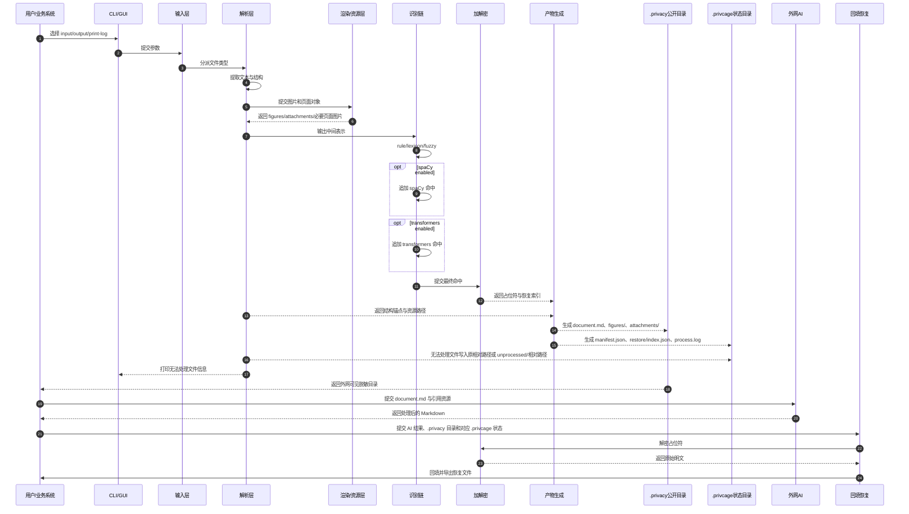
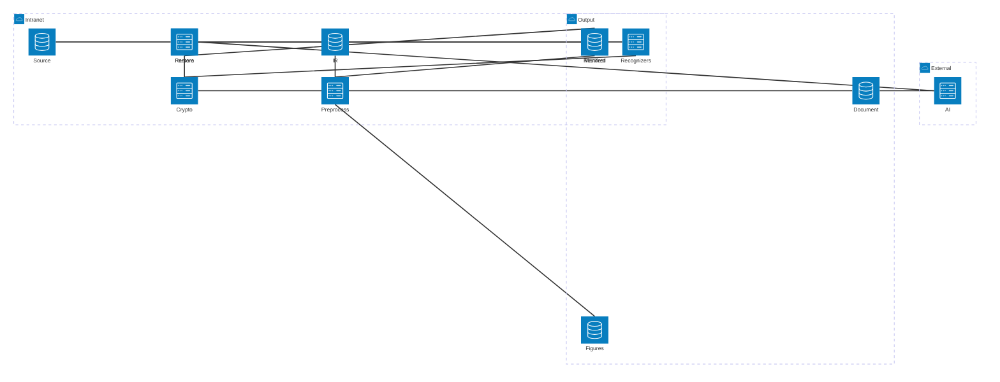
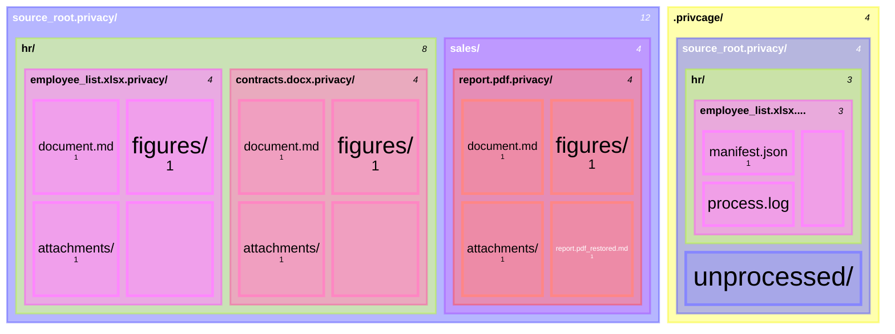

# PrivCage

内网本地隐私脱敏工具。它把 Office/PDF/文本等文件解析成带占位符的 Markdown 工作目录，交给外网 AI 处理后，再在内网用本地配置密钥回填恢复。

核心边界：

- 密钥只在内网保存。
- 外网只接触脱敏后的 `document.md` 与引用资源。
- 每个文件生成独立 `.privacy/` 产物目录。
- 批量目录处理时保持原目录结构。

## 1. 交互方式

提供两种入口：

- `CLI`
- `GUI(exe)`，直接调用同一套 CLI 处理逻辑

GUI 开发运行：

```text
uv pip install -e ".[gui,office,pdf]"
privcage-gui
```

GUI 功能页：

- `预处理`：选择输入和输出，生成外网 `.privacy/` 与内网 `.privcage/`。
- `外发包`：扫描 `.privacy/`，检查是否混入 `manifest.json`、`process.log`、`restore/index.json` 等内网文件。
- `回填恢复`：选择单文件 `.privacy/` 或批量根 `source_root.privacy/` 和 AI Markdown，默认输出到所选 `.privacy/{原名或根目录名}_restored.md`。
- `占位符查询`：输入完整 `[PRIVACY:...]`，返回对应明文。
- `终端`：执行 PowerShell 命令，并显示 GUI 操作对应的 CLI 命令与打印结果。
- `状态与设置`：显示密钥来源和依赖可用性，不显示真实密钥。
- `README`：查看用户指南，并可打开不含代码仓库细节的 PDF 版本。

CLI 参数：

| 参数 | 说明 |
| ---- | ---- |
| `--input` | 输入文件或文件夹 |
| `--output` | 输出根目录 |
| `--print-log` | 将普通处理日志打印到控制台；日志本身始终记录 |
| `--centralize-unprocessed` | 将无法处理文件集中放到批量根目录的 `unprocessed/` 下 |

输出命名：

```text
privcage preprocess --input meeting.docx --output out/
=> out/meeting.docx.privacy/

privcage preprocess --input source_root/ --output out/
=> out/source_root.privacy/

privcage restore --privacy out/meeting.docx.privacy/ --input ai-result.md
=> out/meeting.docx.privacy/meeting.docx_restored.md

privcage restore --privacy out/source_root.privacy/ --input ai-result.md
=> out/source_root.privacy/source_root_restored.md

privcage reveal --privacy out/meeting.docx.privacy/ --placeholder "[PRIVACY:EMAIL:...]"
=> alice@example.com
```

无法处理的文件必须打印信息，即使未开启 `--print-log`。至少打印原始路径、失败阶段、失败原因。

CLI 子命令：

- `preprocess`：生成 `.privacy/` 产物目录。
- `restore`：读取单文件 `.privacy/` 或批量根 `.privacy/`、AI 处理后的 Markdown，并默认输出到所选目录下的 `{原名或根目录名}_restored.md`。单文件场景仍与 `document.md` 并列，以便继续使用同一产物目录下的相对引用资源；批量根场景适合 AI 返回内容合并了多个子文档占位符。
- `reveal`：读取 `.privacy/` 和单个完整占位符，打印对应明文。
- 顶层 `--input/--output` 仍作为 `preprocess` 兼容入口保留。
- 每个内部状态目录都会写入 `process.log`；`--print-log` 只控制是否向控制台打印普通处理日志。

## 2. 输出目录协议

单文件公开输出：

```text
meeting.docx.privacy/
├── document.md
├── figures/
├── attachments/
└── meeting.docx_restored.md
```

目录批量公开输出：

```text
source_root.privacy/
├── hr/
│   ├── employee_list.xlsx.privacy/
│   │   ├── document.md
│   │   ├── figures/
│   │   ├── attachments/
│   │   └── employee_list.xlsx_restored.md
│   ├── contracts.docx.privacy/
│   │   ├── document.md
│   │   ├── figures/
│   │   ├── attachments/
│   │   └── contracts.docx_restored.md
│   └── broken_scan.pdf
├── sales/
│   └── report.pdf.privacy/
│       ├── document.md
│       ├── figures/
│       ├── attachments/
│       └── report.pdf_restored.md
```

内网状态输出：

```text
.privcage/
└── source_root.privacy/
    ├── hr/
    │   ├── employee_list.xlsx.privacy/
    │   │   ├── manifest.json
    │   │   ├── process.log
    │   │   └── restore/
    │   │       └── index.json
    │   ├── contracts.docx.privacy/
    │   │   ├── manifest.json
    │   │   ├── process.log
    │   │   └── restore/
    │   │       └── index.json
    │   └── broken_scan.pdf
    └── unprocessed/
        └── hr/
            └── broken_scan.pdf
```

规则：

- 每个文件生成一个独立 `.privacy/` 目录。
- 批量处理保持输入目录结构。
- `.privacy/` 只保存外网可见文件：`document.md`、`{原名}_restored.md`、`figures/`、`attachments/`。
- `.privcage/` 保存内网状态文件：`manifest.json`、`restore/index.json`、`process.log`、无法处理原文件。
- 默认情况下，无法处理文件按原相对路径放到内部状态根目录下。例如 `source_root/A/B/xxx.xx` 写入 `.privcage/source_root.privacy/A/B/xxx.xx`。
- 开启 `--centralize-unprocessed` 时，无法处理文件集中放到内部状态根目录 `unprocessed/` 下，并保留相对源目录路径。例如 `source_root/A/B/xxx.xx` 写入 `.privcage/source_root.privacy/unprocessed/A/B/xxx.xx`。
- 每个 `.privcage/.../*.privacy/` 独立维护恢复状态，不跨文件共享索引。

## 3. 脱敏 Markdown 协议

`document.md` 使用 YAML front matter：

```markdown
---
document_type: privacy-protected-markdown
protocol_version: v1
encryption:
  algorithm: AES-256-GCM
  key_policy: env-or-user-config-key-in-intranet
  nonce_policy: random-per-fragment
  cipher_blob: base64url-json-envelope
placeholder:
  format: "[PRIVACY:{TYPE}:{cipher_blob}]"
assets:
  figures_dir: "./figures"
  attachments_dir: "./attachments"
processing_notice:
  - "Do not modify PRIVACY placeholders."
---

# 脱敏文档

联系人：[PRIVACY:PERSON:AbCdEf...==]
电话：[PRIVACY:PHONE:ZyXwVu...==]


```

占位符格式：

```text
[PRIVACY:{TYPE}:{cipher_blob}]
```

`cipher_blob` 使用 base64url 编码的 JSON envelope：

```json
{
  "v": 1,
  "alg": "A256GCM",
  "kid": "default",
  "n": "base64url_nonce_96bit",
  "c": "base64url_ciphertext_plus_tag"
}
```

加密规则：

- 主密钥只从内网环境变量或用户配置目录读取，不能写入项目仓库。
- 每个占位符使用独立随机 96-bit nonce。
- `kid` 标识本地密钥版本，用于后续密钥轮换。
- 明文 payload 使用结构化 JSON，例如 `{"text":"张三","hit_id":"h001","label":"PERSON"}`。
- AAD 绑定 `protocol_version`、`privacy_id`、`hit_id`、`placeholder_type`、`source_hash`，防止占位符跨文档搬运后无感解密。
- `manifest.json` 和 `restore/index.json` 不保存明文，只保存 hash、位置、来源和结构锚点。

建议字段类型：

- `PERSON`
- `PHONE`
- `EMAIL`
- `ORG`
- `ADDRESS`
- `ID`
- `ACCOUNT`
- `PROJECT`
- `SECRET_TERM`

## 4. Manifest 协议

需要保留 `manifest.json`。它是内网状态清单，放在输出根目录的 `.privcage/` 镜像树下，用于描述协议版本、源文件摘要、资源路径、识别配置和恢复索引位置；真正的回填索引放在同一状态目录的 `restore/index.json`。

最小 `manifest.json`：

```json
{
  "protocol_version": "v1",
  "privacy_id": "meeting.docx.privacy",
  "source_file": {
    "name": "meeting.docx",
    "type": "docx",
    "sha256": "..."
  },
  "artifacts": {
    "document": "document.md",
    "figures_dir": "figures/",
    "attachments_dir": "attachments/",
    "restore_index": "restore/index.json"
  },
  "recognition": {
    "pipeline": ["rule", "spacy", "transformers"],
    "enabled": {
      "rule": true,
      "spacy": false,
      "transformers": false
    }
  },
  "hits": [],
  "restore_targets": [
    "meeting.docx_restored.md",
    "restore/restored.docx"
  ]
}
```

每个命中至少记录：

- `source`
- `label`
- `text_hash`
- `position`
- `placeholder_type`
- `privacy_placeholder`
- `hit_id`

`restore/index.json` 至少记录：

- `hit_id`
- `privacy_placeholder`
- `source_anchor`
- `source_range`
- `text_hash`
- `placeholder_type`

## 5. 识别链

识别链采用三层叠加：

1. `rule`
2. `spaCy`，可选
3. `transformers`，可选

处理规则：

- `rule` 必开，负责关键词、正则、表头、字段名、用户词库、模糊匹配。
- `spaCy` 只补充新命中，不覆盖 `rule` 或 `lexicon`。
- `transformers` 默认关闭，只补充新命中，不覆盖前两层。
- 命中合并优先级：`rule > lexicon > spacy > transformers`。
- 最终替换集合必须去重、排序、不可重叠。
- 所有命中来源写入 `manifest.json`。

可选配置示例：

```yaml
recognition:
  rule_engine:
    enabled: true
    fuzzy_lexicon:
      enabled: true
      score_cutoff: 90
  spacy:
    enabled: false
    model: zh_core_web_sm
  transformers:
    enabled: false
    model: null
    min_confidence: 0.7
  merge:
    priority: [rule, lexicon, spacy, transformers]
```

## 6. 支持文件

| 类别 | 格式 |
| ---- | ---- |
| 文本 | `.txt`, `.md`, `.rtf` |
| Word | `.doc`, `.docx` |
| 表格 | `.csv`, `.xls`, `.xlsx` |
| PPT | `.ppt`, `.pptx` |
| PDF | `.pdf` |
| 结构化数据 | `.json`, `.xml`, `.yaml` |

说明：

- `.doc`、`.xls`、`.ppt` 需要解析为 Markdown；可在内网通过转换组件转成新格式后再进入同一 Markdown 生成流程。
- PDF 按页处理：能提取文本的页面只写入文字；无法提取文本的图片型页面才按页渲染为图片，并在 `document.md` 中引用。
- 版面还原目标是“足够 AI agent 理解”，不追求像素级复刻。

## 7. Pipeline



## 8. Architecture



## 9. Output Tree



## 10. 项目结构

```text
PrivCage/
|-- pyproject.toml
|-- README.md
|-- config.example/
|   `-- privcage.example.toml
|-- examples/
|   `-- full_test/
|       |-- README.md
|       `-- input/
|-- scripts/
|   `-- build_exe.ps1
|-- src/
|   `-- privcage/
|       |-- cli.py
|       |-- gui_app.py
|       |-- config.py
|       |-- crypto.py
|       |-- env_status.py
|       |-- manifest.py
|       |-- markdown.py
|       |-- placeholder.py
|       |-- processor.py
|       |-- recognize.py
|       |-- restore.py
|       `-- parsers/
|           |-- legacy_office_parser.py
|           |-- office_parser.py
|           |-- pdf_parser.py
|           |-- registry.py
|           `-- text_parser.py
`-- tests/
    |-- test_cli.py
    |-- test_crypto.py
    |-- test_pdf_parser.py
    `-- test_processor.py
```

说明：

- `cli.py` 提供 `preprocess`、`restore`、`reveal`。
- `gui_app.py` 提供 GUI，直接调用核心函数，不复制业务逻辑。
- `processor.py` 负责生成 `.privacy/` 和 `.privcage/`。
- `restore.py` 负责回填和单个 placeholder 查询。
- `parsers/` 负责不同文件格式转 Markdown 中间文本和资源。

## 11. 环境与测试

推荐使用独立 CPython 环境，避免 Anaconda 与 PySide6 的 Qt DLL 冲突：

```powershell
uv venv .venv-gui --python "C:\Program Files\Python312\python.exe"
uv pip install --python .venv-gui\Scripts\python.exe -e ".[dev,gui,office,pdf]"
```

运行测试：

```powershell
.venv-gui\Scripts\python -m pytest
```

当前测试覆盖：

- AES-GCM envelope 加解密。
- CLI `preprocess/restore/reveal`。
- `.privacy/` 与 `.privcage/` 目录隔离。
- 无法处理文件落点。
- PDF 文本页不截图、图片页才截图。

## 12. 打包 EXE

目标是生成可分发的 Windows GUI 程序，让使用者只运行 exe，不需要自己安装 Python 环境。

准备环境：

```powershell
uv pip install --python .venv-gui\Scripts\python.exe pyinstaller
```

打包：

```powershell
powershell -NoProfile -ExecutionPolicy Bypass -File scripts\build_exe.ps1
```

输出：

```text
dist/PrivCage.exe
```

注意：

- `.venv-gui/` 不提交，不随源码分发。
- `dist/` 是生成物，默认忽略。
- PyInstaller 会把 Python 运行时、PySide6、Office/PDF 解析依赖收进 exe。
- LibreOffice 不会被自动打进 exe；旧 `.doc/.xls/.ppt` 转换仍依赖目标机器可用的 LibreOffice，或后续改为捆绑转换组件。

## 13. 当前状态与后续计划

已完成：

- CLI + GUI。
- 外网 `.privacy/` 与内网 `.privcage/` 分离。
- 可逆 placeholder 加密和回填。
- 单个 placeholder reveal。
- 文本、结构化、Office、PDF 基础解析。
- 全量示例目录 `examples/full_test/input/`。
- GUI 教程页和终端页。
- Windows 单文件 exe 打包、独立启动 smoke test。
- 用户指南 Markdown/PDF 随 exe 打包并在 GUI README 页读取。
- `v0.2.0` tag 与 GitHub Release 页面已创建。

后续优先级：

1. 将 `dist/PrivCage.exe` 上传到 `v0.2.0` GitHub Release 资产。
2. GUI 长任务改为后台线程，避免大目录处理时卡顿。
3. 增加用户词库、模糊匹配配置页。
4. 接入可选 spaCy/transformers 识别器。
5. 增加导出回 docx/xlsx/pptx 的能力。
6. 优化旧 Office 转换部署方案；当前仍依赖目标机器可用 LibreOffice。
7. 增加更多端到端样例：混合 PDF、扫描件、旧 Office、复杂表格。

## 14. 示例操作教程

以下示例假设已经安装开发环境：

```powershell
uv venv .venv-gui --python "C:\Program Files\Python312\python.exe"
uv pip install --python .venv-gui\Scripts\python.exe -e ".[dev,gui,office,pdf]"
```

### 14.1 准备测试文件夹

创建一个输入目录，例如：

```text
demo_input/
├── docs/
│   ├── note.txt
│   ├── memo.md
│   └── rich.rtf
├── data/
│   ├── people.csv
│   ├── record.json
│   ├── record.xml
│   └── record.yaml
├── office/
│   ├── meeting.docx
│   ├── contacts.xlsx
│   └── brief.pptx
├── pdf/
│   ├── text.pdf
│   ├── image_only.pdf
│   └── mixed.pdf
└── bad/
    └── nested/
        └── unsupported.bin
```

建议每个可处理文件里放一两个邮箱、手机号或身份证号，便于观察脱敏效果。

### 14.2 CLI：配置密钥

CLI 需要通过环境变量或 key file 提供主密钥。下面是一个测试 key：

```powershell
$env:PRIVCAGE_MASTER_KEY = "NTU1NTU1NTU1NTU1NTU1NTU1NTU1NTU1NTU1NTU1NTU"
```

正式使用时应生成随机 32-byte key，并保存在内网用户配置或 `PRIVCAGE_KEY_FILE` 指向的文件中。

### 14.3 CLI：预处理

```powershell
.venv-gui\Scripts\python -m privcage preprocess `
  --input demo_input `
  --output demo_out `
  --centralize-unprocessed `
  --print-log
```

预期结果：

```text
demo_out/
├── demo_input.privacy/
│   ├── docs/
│   │   └── note.txt.privacy/
│   │       ├── document.md
│   │       ├── figures/
│   │       └── attachments/
│   └── ...
└── .privcage/
    └── demo_input.privacy/
        ├── docs/
        │   └── note.txt.privacy/
        │       ├── manifest.json
        │       ├── process.log
        │       └── restore/
        │           └── index.json
        └── unprocessed/
            └── bad/
                └── nested/
                    └── unsupported.bin
```

说明：

- `demo_input.privacy/` 是外网可见目录，只发送这个目录里的 `document.md`、`figures/`、`attachments/`。
- `.privcage/` 是内网状态目录，不能外发。
- 如果有无法处理文件，CLI 会强制打印 `unprocessed:` 行；存在无法处理文件时退出码可能为 `1`，但已处理文件仍然有效。

### 14.4 CLI：检查 PDF 输出

文本型 PDF 页面只输出文字：

```text
demo_out/demo_input.privacy/pdf/text.pdf.privacy/document.md
```

图片型 PDF 页面才会生成图片：

```text
demo_out/demo_input.privacy/pdf/image_only.pdf.privacy/figures/pdf_pages/page-0001.png
```

混合 PDF 会逐页处理：有文字的页写文字，无文字的页写图片引用。

### 14.5 CLI：外发给 AI

把对应公开目录里的内容交给外网 AI：

```text
demo_out/demo_input.privacy/docs/note.txt.privacy/document.md
demo_out/demo_input.privacy/docs/note.txt.privacy/figures/
demo_out/demo_input.privacy/docs/note.txt.privacy/attachments/
```

不要发送：

```text
demo_out/.privcage/
```

### 14.6 CLI：回填恢复

假设 AI 返回文件为：

```text
ai-result.md
```

执行：

```powershell
.venv-gui\Scripts\python -m privcage restore `
  --privacy demo_out\demo_input.privacy `
  --input ai-result.md `
  --print-log
```

默认输出：

```text
demo_out/demo_input.privacy/demo_input_restored.md
```

如果 AI 只处理了单个文件，也可以选择对应叶子目录，例如 `demo_out\demo_input.privacy\docs\note.txt.privacy`，默认输出仍为 `note.txt_restored.md` 并与该文件的 `document.md` 并列。若 AI Markdown 合并了多个子文档的内容，选择批量根目录即可一次性回填所有命中的占位符。

### 14.7 CLI：查询单个占位符

从 `document.md` 或 AI 返回内容中复制完整占位符：

```text
[PRIVACY:EMAIL:...]
```

执行：

```powershell
.venv-gui\Scripts\python -m privcage reveal `
  --privacy demo_out\demo_input.privacy\docs\note.txt.privacy `
  --placeholder "[PRIVACY:EMAIL:...]"
```

输出示例：

```text
alice@example.com
```

### 14.8 GUI：启动

```powershell
.venv-gui\Scripts\python -m privcage.gui_app
```

或：

```powershell
privcage-gui
```

### 14.9 GUI：配置密钥

1. 打开 `状态与设置`。
2. 点击 `生成随机密钥`。
3. 如果只想本次使用，直接切回 `预处理`。
4. 如果希望下次自动加载，点击 `保存到用户配置`。

GUI 不会在状态摘要里显示真实密钥。

### 14.10 GUI：预处理

1. 打开 `预处理`。
2. `输入` 选择文件或文件夹。
3. `输出根目录` 选择输出位置。
4. 可选勾选 `无法处理文件集中到 .privcage/.../unprocessed`。
5. 点击 `开始预处理`。
6. 查看结果表格里的 `公开目录` 和 `状态目录`。

### 14.11 GUI：外发包检查

1. 打开 `外发包`。
2. 选择一个公开 `.privacy/` 目录。
3. 点击 `扫描外发目录`。
4. 如果提示 `检查通过`，可以把该目录里的 `document.md`、`figures/`、`attachments/` 发给外网 AI。
5. 如果提示内部文件混入，不要外发，先检查目录内容。

### 14.12 GUI：回填恢复

1. 打开 `回填恢复`。
2. 选择公开 `.privacy/` 目录；目录批处理时建议选择批量根 `source_root.privacy/`，单文件处理时选择对应叶子 `.privacy/` 也可以。
3. 选择 AI 返回的 Markdown 文件。
4. 输出路径可留空，默认写入所选目录下的 `{原名或根目录名}_restored.md`。
5. 点击 `开始回填`。

### 14.13 GUI：占位符查询

1. 打开 `占位符查询`。
2. 选择公开 `.privacy/` 目录。
3. 粘贴完整 `[PRIVACY:...]`。
4. 点击 `查询`。
5. 明文显示在结果框中。

### 14.14 GUI：终端

1. 打开 `终端`。
2. 在输入框里写 PowerShell 命令，例如 `.venv-gui\Scripts\python -m privcage --help`。
3. 点击 `执行` 查看 stdout、stderr 和退出码。
4. 使用 GUI 的预处理、回填恢复、占位符查询时，对应 CLI 命令和打印结果也会追加到终端输出区。
